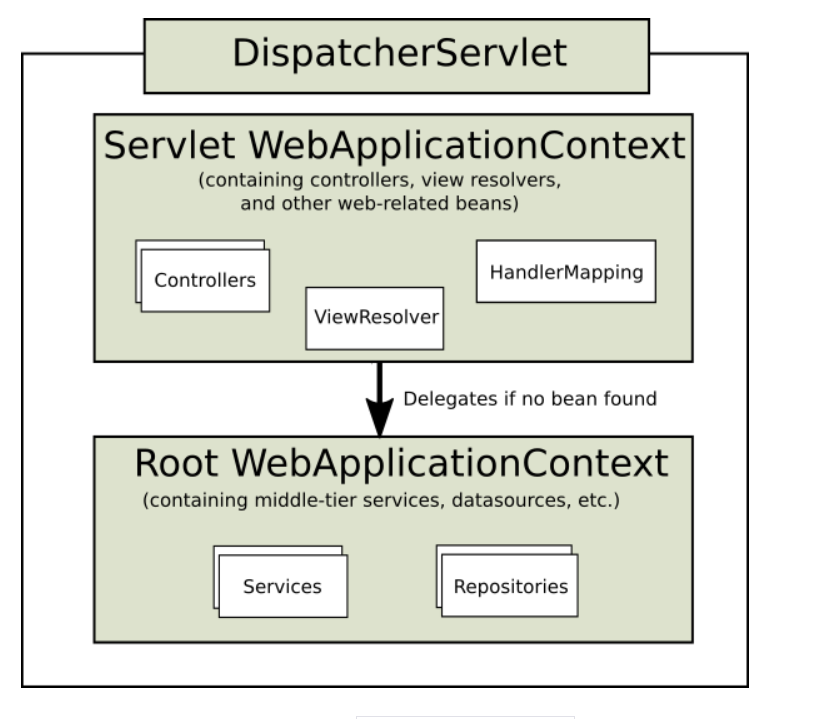
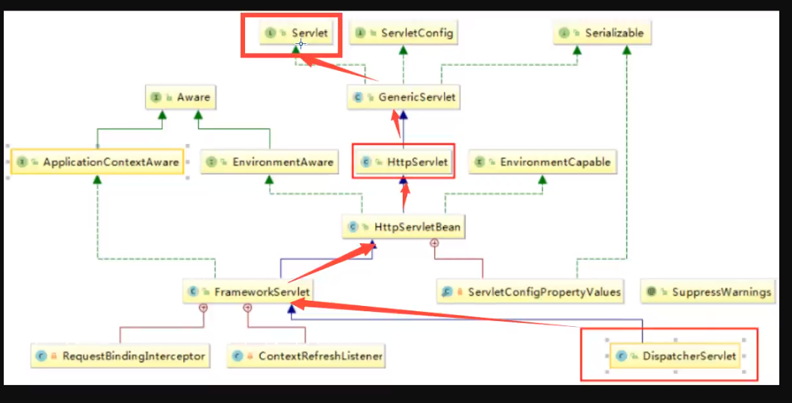

# SpringMVC

ssm：MyBatis + Spring + SpringMVC    **MVC三层架构**

JavaSE：认真学习，老师带，入门快

JavaWeb：认真学习，老师带，入门快

框架：研究官方文档，锻炼自学能力，锻炼笔记能力，锻炼项目能力

SpringMVC + Vue + SpringBoot + SpringCloud + Linux

SSM做项目 = JavaWeb做项目；

Spring： IOC 和 AOP【重要，面试考】

SpringMVC： SpringMVC的执行流程！【面试考，重要】

SpringMVC：SSM框架整合！【容易忘，博客的重要性】

MVC：mdoel（dao、service）	view（jsp）	controller（Servlet）

dao

service

servlet：转发，重定向

jsp、html

前端	数据传输	实体类

实体类：用户名、密码、生日、爱好、、、、20个

前端：用户名，密码

pojo：User

vo：userVo

dto：

JSP：本质就是Servlet

假设：你的项目的架构，是设计好的，还是演进的？

- Alibaba	PHP = Pages（个人网站比较合适）
- 随着用户量大，Java
- 王坚 去IOE   MySQL
- MySQL：MySQL---->AliSQL、AliRedis
- All in one ---> 微服务

servlet就两点：

1. 创建一个类继承HTTPServlet
2. 在web.xml中注册

jsp文件放在哪里，如果是公共的，放在WEB-INF外边，如果为了安全，放在里面

MVC：

MVVM：M	V	VM(ViewModel:双向绑定)

《约定大于配置》

SpringMVC与Spring兼容性好

Spring：大杂烩，我们可以将SpringMVC中所有要用到的Bean，注册到Spring中！

需求分析